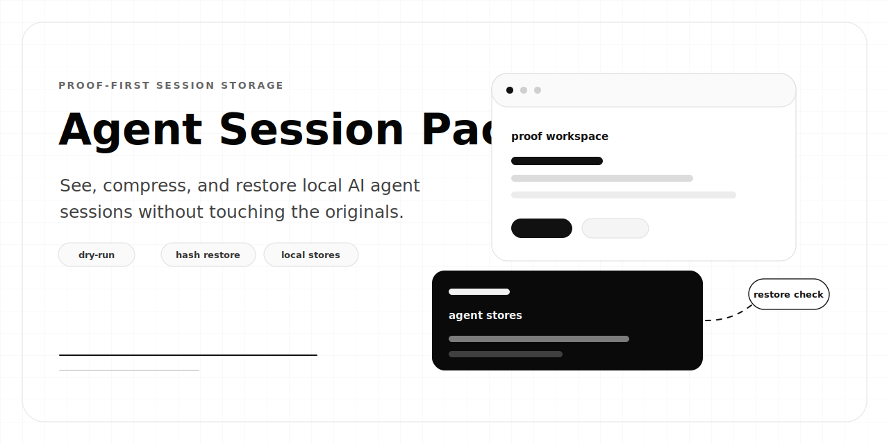

<p align="center">
  
</p>

# Agent Session Pack

Cold storage for local AI coding-agent sessions.

AI coding tools are useful, but their local session history grows quietly: JSONL logs, SQLite stores, browser state, copied context, and provider caches. Agent Session Pack helps you see what is there, prove what can be compressed, and move toward byte-exact restore without breaking resume.

Current build status: dry-run and proof-first. It does not remove real provider session files yet.

## Five-Minute Check

No repo clone, pnpm install, or global install is needed after publish:

```bash
npx --yes agent-session-pack check
```

That command scans supported local AI agents, copies one eligible session per provider into a temp proof workspace, compresses it, restores it, compares hashes, and prints the before/after savings table. Real session files stay untouched.

From this repo:

```bash
pnpm install
pnpm health
pnpm dev --check
pnpm savings
pnpm pack:dry-run
```

After npm publish:

```bash
npx agent-session-pack doctor
npx agent-session-pack check
npx agent-session-pack savings
npx agent-session-pack pack --dry-run
```

Or install the CLI:

```bash
npm install -g agent-session-pack
agent-session-pack doctor
agent-session-pack check
agent-session-pack savings
```

## What You Get

`check` and `savings` copy one eligible local session per provider, compress the copy, restore it, compare SHA-256 hashes, and print a human table. Originals are not modified.

Example from this machine:

```text
Provider   Sessions  Mode         Before     After      Saved    Exact   Touched
codex      547       archive      8.5 MB     1.6 MB     80.7%    yes     no
claude     176       archive      34.8 KB    10.4 KB    70.0%    yes     no
kiro       227       archive      1.1 MB     129 KB     88.6%    yes     no
devin      8         backup-only  92.6 MB    12.8 MB    86.2%    yes     no
total      958                    102 MB     14.6 MB    85.7%            no
```

`pack --dry-run` scans all providers and prints the cleanup plan without changing files.

## Architecture Flow

Current safe check:

```text
+------------------+      +------------------+      +------------------+
| AI agent stores  | ---> | proof workspace  | ---> | savings table    |
| read-only scan   |      | copy + compress  |      | before / after   |
| codex, claude,   |      | restore copy     |      | exact / touched  |
| kiro, cursor,    |      | SHA-256 compare  |      | sessions found   |
| devin            |      |                  |      |                  |
+------------------+      +------------------+      +------------------+
```

Target lifecycle after one-time setup:

```text
+-----------------------------+
| agent-session-pack init     |
| choose providers            |
| confirm 7d default          |
| confirm vault path          |
+--------------+--------------+
               |
               v
+-----------------------------+      relaunch/resume       +-----------------------------+
| ~/.agent-session-pack       | -------------------------> | restore native file         |
| provider policy             |                            | from verified archive       |
| lifecycle hooks             | <------------------------- | run the agent session       |
+--------------+--------------+      session closes        +--------------+--------------+
               |                                                    |
               v                                                    v
+-----------------------------+      verify before remove  +-----------------------------+
| pack cold sessions          | -------------------------> | compressed vault            |
| copy, archive, hash         |                            | manifest + tombstone        |
| restore check               |                            | byte-exact recovery         |
+-----------------------------+                            +-----------------------------+
```

The first row exists today through `check`, `savings`, and `pack --dry-run`. The lifecycle hook row is the next feature: `init` should make the developer explicitly choose providers and acknowledge that selected agents will restore on relaunch and pack again after close.

## Commands

```bash
agent-session-pack check [--provider codex|claude|kiro|cursor|devin] [--json]
agent-session-pack doctor [--json]
agent-session-pack scan [--provider codex|claude|kiro|cursor|devin] [--json]
agent-session-pack savings [--provider codex|claude|kiro|cursor|devin] [--json]
agent-session-pack pack [--provider codex|claude|kiro|cursor|devin] [--older-than 7d] [--dry-run|--apply] [--json]
agent-session-pack list [--provider codex|claude|kiro|cursor|devin] [--json]
agent-session-pack restore <selector> [--to original|<path>] [--json]
agent-session-pack pin <selector>
agent-session-pack unpin <selector>
agent-session-pack prune [--quarantine] [--dry-run|--apply]
```

Local development aliases:

```bash
pnpm health
pnpm dev --check
pnpm dev --doctor
pnpm dev --scan --provider devin
pnpm savings --provider devin
pnpm evidence:local --provider devin
pnpm pack:dry-run
```

`pnpm doctor` is pnpm's own built-in command, so this repo uses `pnpm health`. `pnpm evidence:local` is kept as an alias for older proof notes; `pnpm savings` is the preferred human command.

## Safety Model

Agent Session Pack is built around byte-exact restore, not best-effort compression.

- Normal tests use fixtures only.
- `savings` works on copied session files and reports `Original sessions touched: no`.
- `pack --dry-run` does not mutate provider stores.
- `pack --apply` is intentionally blocked until restore/list indexing is complete enough for safe recovery.
- Cursor and Devin are backup-only until their storage models are safer to mutate.

Archive/remove/restore support targets Codex, Claude Code user-level sessions, and Kiro first. Devin discovery reads `~/.local/share/devin/cli/sessions.db` as SQLite metadata and never reads credentials.

## Local Impact

This is one machine's evidence, not a universal benchmark.

| Provider | Before | After | Saved |
| --- | ---: | ---: | ---: |
| Codex | 2.22 GB | 782 MB | 65.6% |
| Claude | 2.10 GB | 457 MB | 78.7% |
| Kiro | 1.95 GB | 190 MB | 90.5% |
| Cursor backup | 7.27 GB | 957 MB | 87.1% |
| Total | 13.5 GB | 2.3 GB | about 83% |

## Proof

Committed fixtures in `examples/roundtrip/` show before/archive/after files for small sessions. Local proof with real sessions is generated by `pnpm savings` because real provider stores should not be committed.

| Provider | Source | Archive | Saved | Lines | Byte exact | Original touched |
| --- | ---: | ---: | ---: | ---: | --- | --- |
| Kiro latest | 1,160,471 B | 132,557 B | 88.6% | 266 | yes | no |
| Claude oldest | 6,470,568 B | 1,265,093 B | 80.4% | 2,722 | yes | no |
| Codex oldest | 104,229 B | 25,422 B | 75.6% | 24 | yes | no |
| Devin local DB | 97,058,816 B | 13,425,614 B | 86.2% | n/a | yes | no |

## Development

```bash
pnpm check:ci
pnpm typecheck
pnpm test
pnpm build
npm publish --dry-run
```

Agent editing rules live in `AGENTS.md`; code style and command contracts live in `CODE-STYLE.md`.
