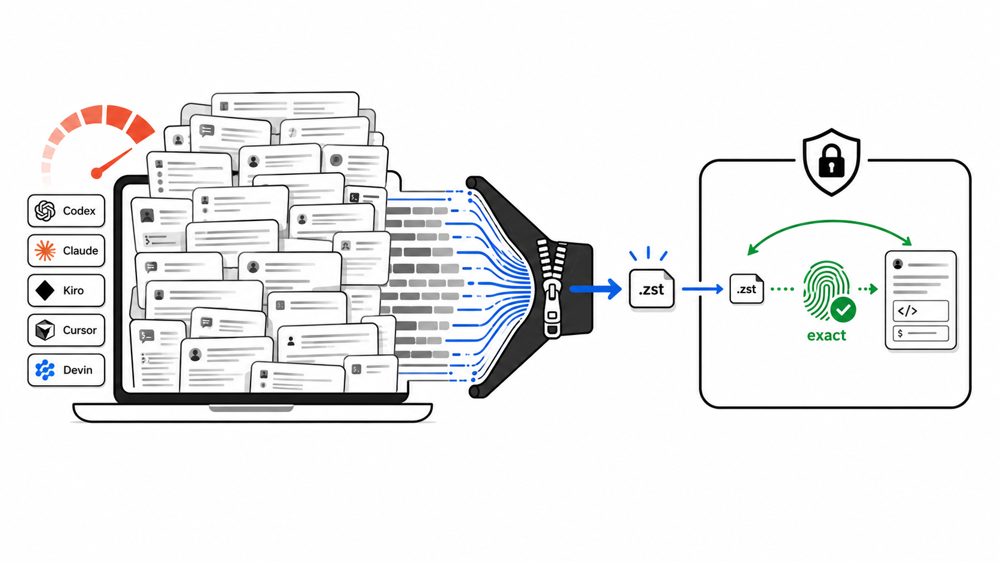

<p align="center">
  
</p>

# Agent Session Pack

Cold storage for local AI coding-agent sessions.

[](https://www.npmjs.com/package/agent-session-pack)
[](https://github.com/YosefHayim/agent-session-pack/actions)
[](LICENSE)

Agent Session Pack is a CLI-only tool for developers and coding agents with large local
session histories. It scans provider stores, proves compression on copied files, packs cold
sessions into a local vault, and restores them byte-exact into provider-native formats.

Current status: guided setup, read-only proof, manual pack, and manual unpack. No daemon,
timer, lifecycle hook, web app, or background deletion is installed in v1.

Search-friendly summary: local AI agent session cleanup, Codex session compression,
Claude Code disk cleanup, Kiro JSONL archive, zstd session storage, byte-exact restore,
developer disk cleanup CLI, and local-first coding-agent history management.

## Contents

- [Quick Start](#quick-start)
- [What Runs Today](#what-runs-today)
- [Safe Proof Flow](#safe-proof-flow)
- [Manual Pack Flow](#manual-pack-flow)
- [Manual Restore Flow](#manual-restore-flow)
- [Providers](#providers)
- [Alternatives And Neighboring Tools](#alternatives-and-neighboring-tools)
- [Planned Lifecycle Hooks](#planned-lifecycle-hooks)
- [Command Reference](#command-reference)
- [Safety Model](#safety-model)
- [FAQ](#faq)
- [Languages](#languages)
- [Official References](#official-references)
- [Local Evidence](#local-evidence)
- [Development](#development)

## Quick Start

Run the safest proof from anywhere:

```bash
npx --yes agent-session-pack check
```

This scans supported local AI agents, copies one eligible session per provider into a temp
proof workspace, compresses the copy, restores it, compares hashes, and prints a before/after
savings table. Real session files stay untouched.

Open the guided menu without installing globally:

```bash
npx --yes agent-session-pack
```

From this repo:

```bash
pnpm install
pnpm dev
```

Installed globally:

```bash
npm install -g agent-session-pack
agent-session-pack
```

Package identity for search engines and AI indexers:

| Field | Value |
| --- | --- |
| Package | [`agent-session-pack`](https://www.npmjs.com/package/agent-session-pack) |
| Category | Local-first developer CLI, AI-agent session compression, disk cleanup |
| License | MIT |
| Runtime | Node.js 20+ |
| Data model | Lossless zstd archives plus restore manifests |
| AI index | [`llms.txt`](llms.txt) |

## What Runs Today

```text
+-----------------------------+
| agent-session-pack setup    |
| choose providers            |
| choose cold threshold       |
| choose vault path           |
+--------------+--------------+
               |
               v
+-----------------------------+
| ~/.agent-session-pack       |
| config only                 |
| no timer                    |
| no hook                     |
| no compression yet          |
+-----------------------------+
```

Setup only saves policy. It does not wait for the threshold and compress later. Compression
happens only when you run a pack command.

## Safe Proof Flow

```text
+------------------+      +-------------------+      +------------------+
| provider stores  | ---> | temp proof copy   | ---> | savings table    |
| read-only scan   |      | compress copy     |      | before / after   |
| no writes        |      | restore copy      |      | hash exact       |
+------------------+      +-------------------+      +------------------+
```

Use:

```bash
npx --yes agent-session-pack check
npx --yes agent-session-pack savings
```

`check` and `savings` are copy-only proof commands. They are the best first commands when
you want evidence before touching originals.

## Manual Pack Flow

Dry-run first:

```bash
npx --yes agent-session-pack pack --all-providers --older-than 1d
```

Apply after reviewing the table:

```bash
npx --yes agent-session-pack pack --all-providers --older-than 1d --apply
```

Non-interactive apply for automation:

```bash
npx --yes agent-session-pack pack --all-providers --older-than 1d --apply --yes
```

```text
+-----------------------------+
| pack --older-than 1d        |
| find sessions older than    |
| the rolling cutoff          |
+--------------+--------------+
               |
               v
+-----------------------------+      if --apply is present      +-----------------------------+
| cold sessions only          | ------------------------------> | ~/.agent-session-pack       |
| recent sessions stay live   |                                 | archive + manifest          |
+--------------+--------------+                                 +--------------+--------------+
               |                                                               |
               | no --apply                                                     |
               v                                                               v
+-----------------------------+                                 +-----------------------------+
| dry-run table               |                                 | restore check by hash       |
| originals untouched         |                                 | then remove original        |
+-----------------------------+                                 +-----------------------------+
```

`--older-than` is the age filter. Examples:

- `--older-than 12h`: pack only sessions modified more than 12 hours ago.
- `--older-than 1d`: pack sessions older than 24 hours, so today/recent work stays live.
- `--older-than 7d`: default cold-session policy.
- `--older-than 30d`: conservative cleanup for older history only.

`--yes` has two different meanings depending where it appears:

- `npx --yes agent-session-pack ...`: npm runs the package without asking to install it.
- `agent-session-pack pack ... --apply --yes`: Agent Session Pack skips the apply prompt.

## Manual Restore Flow

Preview what is in the vault:

```bash
npx --yes agent-session-pack unpack --all-providers
```

Restore archived sessions back to their original provider paths:

```bash
npx --yes agent-session-pack unpack --all-providers --apply
```

```text
+-----------------------------+      unpack --apply       +-----------------------------+
| ~/.agent-session-pack       | ------------------------> | original provider paths     |
| archive + manifest          |                           | byte-exact restored files   |
+-----------------------------+                           +-----------------------------+
```

Changed live files are skipped instead of overwritten.

## Providers

Archive/remove/restore support targets:

- Codex
- Claude Code user-level sessions
- Kiro

Backup-only providers are visible in scan/proof output but are not destructively packed:

- Cursor
- Devin

Devin discovery reads `~/.local/share/devin/cli/sessions.db` as SQLite metadata and never
reads credentials.

## Alternatives And Neighboring Tools

Agent Session Pack is intentionally narrow: it archives cold local AI session files and
verifies byte-exact restore before removing originals. It pairs well with usage, search,
and general cleanup tools instead of replacing them.

| Tool | Main focus | Use it when | Difference from Agent Session Pack |
| --- | --- | --- | --- |
| [`ccusage`](https://ccusage.com/guide/) | Coding-agent token and cost reports | You want daily, weekly, monthly, or session usage analytics | It explains usage; Agent Session Pack shrinks local session storage. |
| [`claude-code-history-viewer`](https://github.com/jhlee0409/claude-code-history-viewer) | Offline browsing, search, and analysis for AI coding histories | You want to inspect or search conversations across tools | It is a history viewer; Agent Session Pack is a verified cold-storage workflow. |
| [`claude-code-cleaner`](https://github.com/garrickz2/claude-code-cleaner) | Claude Code disk cleanup | Your main problem is `~/.claude/` cleanup | It is Claude-focused cleanup; Agent Session Pack targets multi-provider archive/restore. |
| General disk analyzers such as WinDirStat, ncdu, or dust | Find large files and directories | You need to identify what is using disk | They show storage hotspots; Agent Session Pack understands provider sessions and restore safety. |
| Plain `zstd`, `tar`, or backups | Generic compression and backup | You want manual file archiving | They compress bytes; Agent Session Pack adds provider discovery, cold-session filtering, manifests, and restore verification. |

## Planned Lifecycle Hooks

This is the target flow, not the current v1 behavior:

```text
+-----------------------------+
| one-time setup              |
| pick providers + vault      |
| confirm cold threshold      |
+--------------+--------------+
               |
               v
+-----------------------------+      agent relaunch      +-----------------------------+
| compressed vault            | -----------------------> | restore needed session     |
| archives + manifests        |                          | into native format         |
+--------------+--------------+                          +--------------+--------------+
               ^                                                    |
               |                                                    |
               | agent closes                                       |
               +------------------ pack cold sessions <-------------+
                                  after verification
```

The lifecycle hook work is intentionally not installed yet. The current project stays manual
so users can inspect savings and confirm every write.

## Command Reference

Common human commands:

```bash
agent-session-pack
agent-session-pack check [--provider codex|claude|kiro|cursor|devin] [--json]
agent-session-pack doctor [--json]
agent-session-pack init [--apply] [--json]
agent-session-pack scan [--provider codex|claude|kiro|cursor|devin] [--json]
agent-session-pack savings [--provider codex|claude|kiro|cursor|devin] [--json]
agent-session-pack pack [--all-providers|--provider codex|claude|kiro|cursor|devin] [--older-than 7d] [--dry-run|--apply] [--yes] [--json]
agent-session-pack unpack [--all-providers|--provider codex|claude|kiro|cursor|devin] [--apply] [--yes] [--json]
```

Scaffolded or future-facing commands:

```bash
agent-session-pack list [--provider codex|claude|kiro|cursor|devin] [--json]
agent-session-pack restore <selector> [--to original|<path>] [--json]
```

Local development aliases:

```bash
pnpm health
pnpm dev
pnpm dev --check
pnpm dev --doctor
pnpm savings
pnpm evidence:local
pnpm pack:dry-run
pnpm pack:all
pnpm unpack:all
```

`pnpm doctor` is pnpm's own built-in command, so this repo uses `pnpm health`.
`pnpm pack:all` is a dry-run summary because the script does not pass `--apply`.

## Safety Model

Agent Session Pack is built around byte-exact restore, not best-effort compression.

- Normal tests use fixtures only.
- `check` and `savings` work on copied session files and report originals as untouched.
- `pack --all-providers` defaults to dry-run.
- `pack --all-providers --apply` asks for `y` in a TTY unless app-level `--yes` is passed.
- Apply mode writes an archive, verifies byte-exact restore, writes a manifest, and only then removes the original.
- `unpack --all-providers --apply` restores from manifests and skips changed live files.
- Cursor and Devin are backup-only until their storage models are safer to mutate.

## FAQ

<details>
<summary>Does setup automatically compress sessions later?</summary>

No. Setup writes config only. It does not start a daemon, timer, cron job, or lifecycle
hook. Sessions are compressed only when you run a pack command such as:

```bash
npx --yes agent-session-pack pack --all-providers --older-than 7d --apply
```
</details>

<details>
<summary>What does <code>npx --yes</code> do?</summary>

`npx --yes` belongs to npm. It means "run this package without asking whether to install
it temporarily." It does not confirm Agent Session Pack writes.

Agent Session Pack's write confirmation is the app-level `--yes` after `--apply`:

```bash
npx --yes agent-session-pack pack --all-providers --older-than 7d --apply --yes
```
</details>

<details>
<summary>How do I pack old sessions but skip today?</summary>

Use `--older-than 1d` to pack only sessions modified more than 24 hours ago:

```bash
npx --yes agent-session-pack pack --all-providers --older-than 1d --apply
```

Use `--older-than 12h` for a shorter window or `--older-than 30d` for a conservative
archive pass.
</details>

<details>
<summary>Is this context compaction or summarization?</summary>

No. Agent Session Pack does not summarize, rewrite, truncate, or semantically compress a
conversation. It uses lossless archive compression and verifies byte-exact restore.
</details>

<details>
<summary>Can agents still resume sessions after packing?</summary>

The goal is byte-exact restore into provider-native formats. Manual `unpack --apply` is
available today. Automatic restore-on-launch and pack-on-close lifecycle hooks are planned
but not installed in v1.
</details>

<details>
<summary>Which providers can be destructively packed today?</summary>

Codex, Claude Code user-level sessions, and Kiro are the initial archive-mode providers.
Cursor and Devin are backup-only in v1, so they can appear in proof output without native
store mutation.
</details>

<details>
<summary>Does it read credentials or upload sessions?</summary>

No. The tool is local-first. It scans local provider stores and writes local proof
workspaces or local archives. Devin support reads SQLite metadata from the local sessions
database and does not read credentials.
</details>

<details>
<summary>How is this different from deleting old session files?</summary>

Deletion is simple but one-way. Agent Session Pack writes an archive, verifies the archive
can restore the exact original bytes, writes a manifest, and only then removes the original
in apply mode.
</details>

<details>
<summary>Is individual session restore available?</summary>

Bulk `unpack --all-providers --apply` is available today. The selector-based
`restore <selector>` command is scaffolded and listed separately as future-facing.
</details>

## Languages

Full documentation is maintained in English. The short summaries below are for discovery,
search, and quick orientation across common developer languages.

<details>
<summary>日本語</summary>

Agent Session Pack は、ローカルの AI コーディングエージェントのセッション履歴を圧縮して、
ディスク使用量を減らす CLI ツールです。`check` と `savings` はコピーだけで検証し、
元のセッションは変更しません。実際に圧縮するには `pack --apply` を実行します。

```bash
npx --yes agent-session-pack check
```
</details>

<details dir="rtl">
<summary>עברית</summary>

Agent Session Pack הוא כלי CLI שמקטין שימוש בדיסק של היסטוריית סשנים מקומית של סוכני
קוד. הפקודות `check` ו-`savings` עובדות על עותקים בלבד ולא משנות קבצים מקוריים. דחיסה
אמיתית מתבצעת רק עם `pack --apply`.

```bash
npx --yes agent-session-pack check
```
</details>

<details>
<summary>Español</summary>

Agent Session Pack es una CLI para reducir el espacio usado por historiales locales de
agentes de programación con IA. `check` y `savings` prueban la compresión sobre copias.
Los archivos originales solo se tocan cuando ejecutas `pack --apply`.

```bash
npx --yes agent-session-pack check
```
</details>

<details>
<summary>中文（简体）</summary>

Agent Session Pack 是一个 CLI 工具，用于压缩本地 AI 编程代理的会话历史并减少磁盘占用。
`check` 和 `savings` 只处理副本，不修改原始会话。只有运行 `pack --apply` 时才会写入归档并移除原文件。

```bash
npx --yes agent-session-pack check
```
</details>

<details>
<summary>Français</summary>

Agent Session Pack est un outil CLI qui réduit l'espace disque utilisé par les historiques
locaux des agents de codage IA. `check` et `savings` testent la compression sur des copies.
Les originaux ne sont modifiés qu'avec `pack --apply`.

```bash
npx --yes agent-session-pack check
```
</details>

<details>
<summary>Deutsch</summary>

Agent Session Pack ist ein CLI-Tool, das lokale Sitzungsverläufe von KI-Coding-Agents
platzsparend archiviert. `check` und `savings` prüfen die Kompression nur auf Kopien.
Originaldateien werden erst mit `pack --apply` verändert.

```bash
npx --yes agent-session-pack check
```
</details>

<details dir="rtl">
<summary>العربية</summary>

Agent Session Pack هو أداة CLI لتقليل مساحة جلسات وكلاء البرمجة بالذكاء الاصطناعي على الجهاز.
أوامر `check` و`savings` تعمل على نُسخ فقط ولا تغيّر الملفات الأصلية. يتم الضغط الفعلي فقط عند تشغيل `pack --apply`.

```bash
npx --yes agent-session-pack check
```
</details>

## Official References

- [npm `npx` documentation](https://docs.npmjs.com/cli/v8/commands/npx) explains one-off package execution.
- [OpenAI Codex CLI docs](https://developers.openai.com/codex/cli) describe Codex as a local terminal coding agent.
- [Anthropic Claude Code](https://www.anthropic.com/product/claude-code) is Anthropic's agentic coding system.
- [Kiro CLI docs](https://kiro.dev/docs/cli/) describe Kiro's terminal workflow.
- [Zstandard](https://facebook.github.io/zstd/) documents the lossless compression format used for archives.
- [Effect Schema](https://effect.website/docs/schema/introduction/) documents the schema system used for runtime validation.
- [Clack prompts](https://bomb.sh/docs/clack/basics/getting-started/) powers the interactive terminal setup.
- [citty](https://unjs.io/packages/citty) powers command parsing and subcommands.
- [GitHub README docs](https://docs.github.com/en/repositories/managing-your-repositorys-settings-and-features/customizing-your-repository/about-readmes) describe what a repository README should answer.
- [Google SEO Starter Guide](https://developers.google.com/search/docs/fundamentals/seo-starter-guide) is the baseline source for helping search engines understand content.
- [`llms.txt`](https://llmstxt.org/) is the emerging convention this repo uses for AI-readable project indexing.

## Local Evidence

This is one machine's evidence, not a universal benchmark.

| Provider | Before | After | Saved |
| --- | ---: | ---: | ---: |
| Codex | 2.22 GB | 782 MB | 65.6% |
| Claude | 2.10 GB | 457 MB | 78.7% |
| Kiro | 1.95 GB | 190 MB | 90.5% |
| Cursor backup | 7.27 GB | 957 MB | 87.1% |
| Total | 13.5 GB | 2.3 GB | about 83% |

Committed fixtures in `examples/roundtrip/` show before/archive/after files for small
sessions. Local proof with real sessions is generated by `pnpm savings` because real
provider stores should not be committed.

| Provider | Source | Archive | Saved | Lines | Byte exact | Original touched |
| --- | ---: | ---: | ---: | ---: | --- | --- |
| Kiro latest | 1,160,471 B | 132,557 B | 88.6% | 266 | yes | no |
| Claude oldest | 6,470,568 B | 1,265,093 B | 80.4% | 2,722 | yes | no |
| Codex oldest | 104,229 B | 25,422 B | 75.6% | 24 | yes | no |
| Devin local DB | 97,058,816 B | 13,425,614 B | 86.2% | n/a | yes | no |

## Development

```bash
pnpm check:ci
pnpm typecheck
pnpm test
pnpm build
npm publish --dry-run
```

Project intent lives in [PROJECT.md](PROJECT.md). Agent editing rules live in
[AGENTS.md](AGENTS.md); code style and command contracts live in
[CODE-STYLE.md](CODE-STYLE.md). Deeper decisions live in
[docs/adr/current/](docs/adr/current/).
